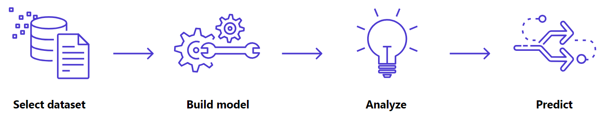

# Previsão de Estoque com Machine Learning no AWS SageMaker Canvas

Este projeto foi desenvolvido como parte do desafio de projeto da DIO para reforçar conceitos práticos de Machine Learning utilizando o **Amazon SageMaker Canvas**. :contentReference[oaicite:3]{index=3}

---

## 📌 Objetivo

Desenvolver um modelo de previsão de estoque inteligente usando ferramentas no‑code da AWS e documentar todo o processo para portfólio. :contentReference[oaicite:4]{index=4}

---

## 📂 Estrutura do Projeto

lab-aws-sagemaker-canvas-estoque/
├── dataset/
│ ├── dataset-500-curso.csv
│ ├── dataset-1000-promo.csv
│ ├── dataset-1000-var.csv
│ └── estoque.csv
├── resultados/
│ └── previsoes.csv
├── images/
│ └── fluxo_sagemaker_canvas.png
└── README.md

---

## 📈 Fluxograma do Processo

Abaixo está o fluxo de trabalho desde a importação de dados até a geração de previsões:

---

### Código Mermaid do Fluxograma (renderizável no GitHub)

flowchart TD
    A[Início] --> B[Preparação Inicial]
    B --> B1[Criar conta na AWS]
    B --> B2[Acessar SageMaker Canvas]
    B --> B3[Fazer fork do repositório GitHub]

    B --> C[Seleção e Importação do Dataset]
    C --> C1[Navegar até a pasta datasets]
    C --> C2[Selecionar dataset]
    C --> C3[Upload do dataset no Canvas]

    C --> D[Preparação e Limpeza de Dados]
    D --> D1[Verificar e tratar valores faltantes]
    D --> D2[Ajustar tipos e formatação]
    D --> D3[Definir variáveis de entrada e saída]

    D --> E[Construção e Treinamento do Modelo]
    E --> E1[Selecionar tipo de modelo]
    E --> E2[Configurar entradas e saída]
    E --> E3[Iniciar treinamento]

    E --> F[Avaliação e Ajustes]
    F --> F1[Revisar métricas de performance]
    F --> F2[Verificar importância das features]
    F --> F3[Ajustar e retrain se necessário]

    F --> G[Geração de Previsões]
    G --> G1[Aplicar modelo a novos dados]
    G --> G2[Exportar resultados]
    G --> G3[Analisar previsões e extrair insights]

    G --> H[Documentação e Entrega]
    H --> H1[Atualizar README.md]
    H --> H2[Adicionar prints ou gráficos]
    H --> H3[Commit e enviar link na DIO]

    H --> I[Fim]

---

## 📊 Descrição do Dataset

O arquivo `dataset/estoque.csv` apresenta o histórico de estoque/vendas dos produtos utilizados no treinamento do modelo.

---

## 🔍 Resultados

O arquivo `resultados/previsoes.csv` contém as previsões geradas pelo modelo treinado no SageMaker Canvas. Use estes dados para auxiliar no planejamento e tomada de decisões de estoque.

---

## 🛠️ Ferramentas e Tecnologias

- Amazon SageMaker Canvas – Machine Learning sem código. :contentReference[oaicite:5]{index=5}  
- Git e GitHub – Controle de versão.  
- CSV – Estrutura de dados tabulares.

---

## 🚀 Observações Finais

Este projeto demonstra o fluxo completo para criação de modelos preditivos no SageMaker Canvas, incluindo preparação de dados, treinamento, avaliação e exportação de previsões com documentação didática para portfólio profissional.

---

## 👤 Autor

João Marcos Araújo Lima  
Seu GitHub: https://github.com/jmarcosaraujo

